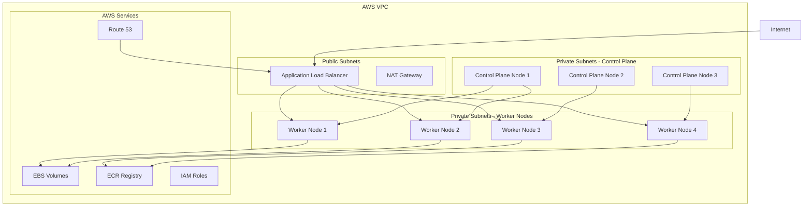
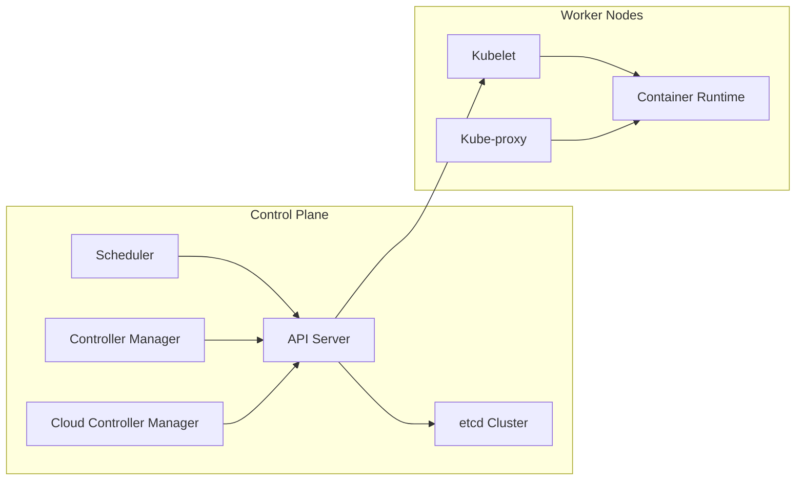
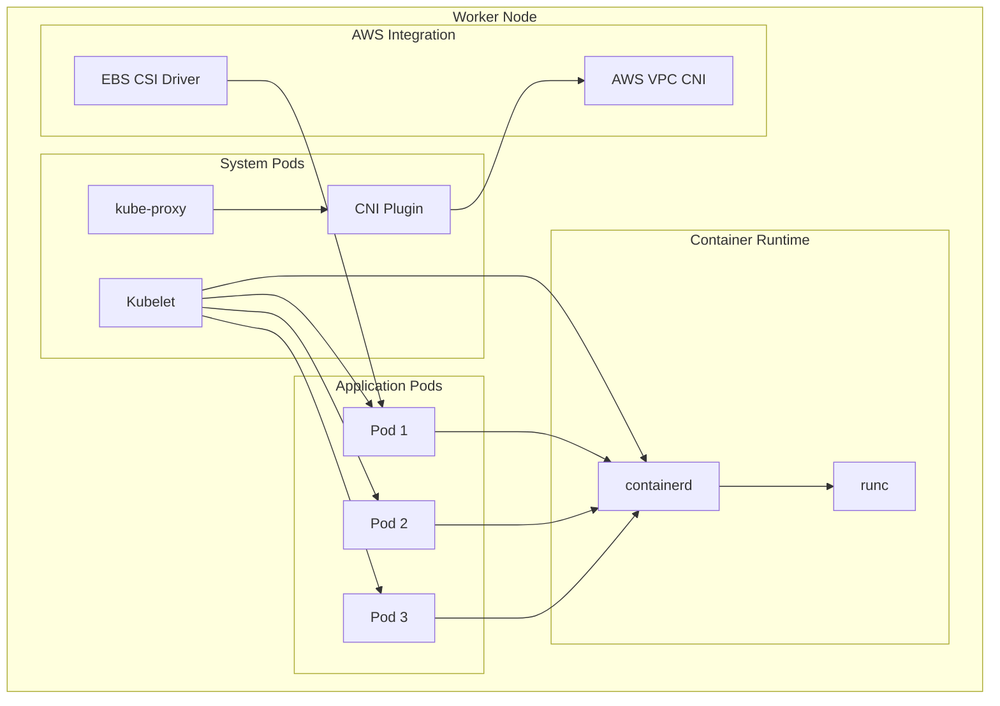
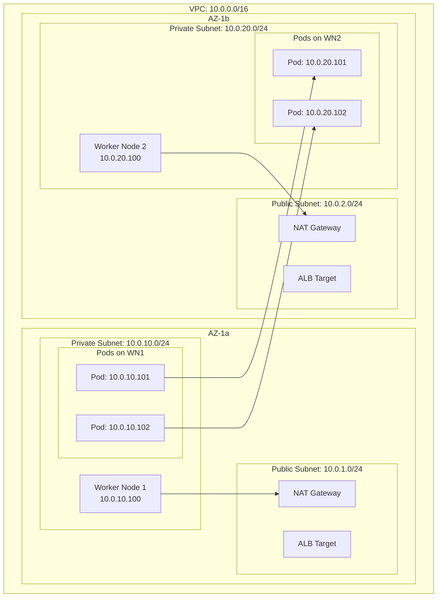
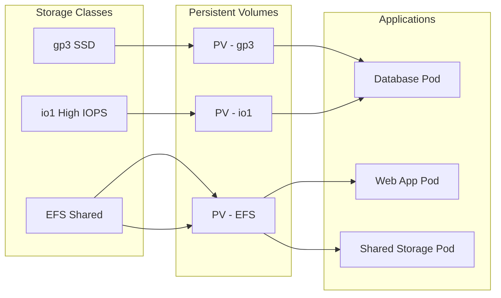
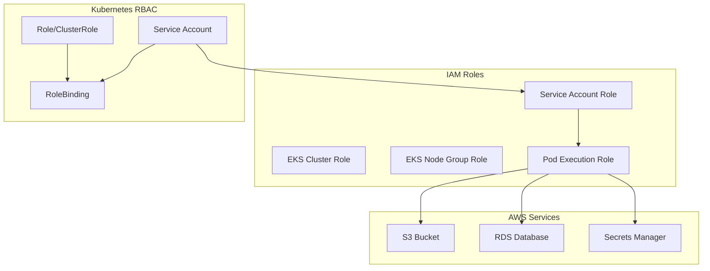

Kubernetes has become the de facto standard for container orchestration, and when combined with AWS's robust cloud infrastructure, it provides a powerful platform for deploying and managing applications at scale. In this post, we'll explore the architecture of a production-ready Kubernetes cluster on AWS.

## High-Level Architecture Overview

Let's start with a bird's-eye view of how Kubernetes components interact within an AWS environment:

## Control Plane Components

The Kubernetes control plane is the brain of your cluster. On AWS, we typically run control plane components across multiple Availability Zones for high availability:

### Key Control Plane Components:

- **API Server**: The central management entity that exposes the Kubernetes API
- **etcd**: Distributed key-value store that holds cluster state
- **Scheduler**: Assigns pods to nodes based on resource requirements
- **Controller Manager**: Runs controller processes that regulate cluster state
- **Cloud Controller Manager**: Integrates with AWS-specific resources

## Worker Node Architecture

Each worker node runs the necessary components to host application pods and communicate with the control plane:

## Networking Architecture

Kubernetes networking on AWS leverages the VPC CNI plugin for native AWS networking:

## Storage Architecture

AWS provides multiple storage options for Kubernetes workloads:

## Security and IAM Integration

Security in EKS involves multiple layers of AWS IAM integration:

## Best Practices for Production

1. **Multi-AZ Deployment**: Spread control plane and worker nodes across multiple availability zones
2. **Network Segmentation**: Use private subnets for worker nodes, public subnets only for load balancers
3. **Resource Management**: Implement resource requests and limits for all pods
4. **Security**: Enable Pod Security Standards and use IAM roles for service accounts
5. **Monitoring**: Implement comprehensive logging and monitoring with CloudWatch and Prometheus

## Conclusion

Understanding Kubernetes architecture on AWS is crucial for building resilient, scalable applications. The integration between Kubernetes and AWS services provides powerful capabilities for storage, networking, and security that can handle enterprise-grade workloads.

The key to success lies in properly configuring each component and following AWS and Kubernetes best practices for production deployments. With this foundation, you can build robust container platforms that scale with your business needs.
